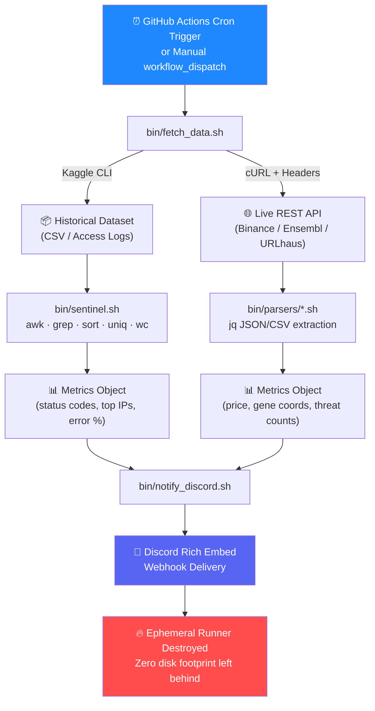
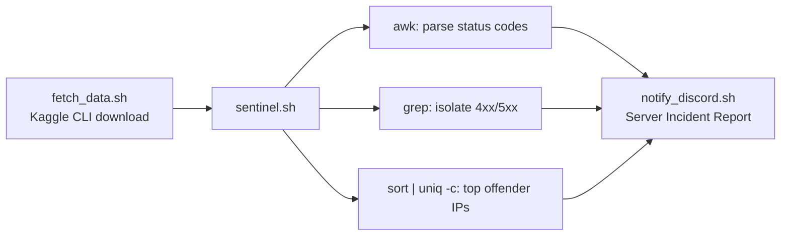
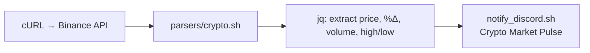
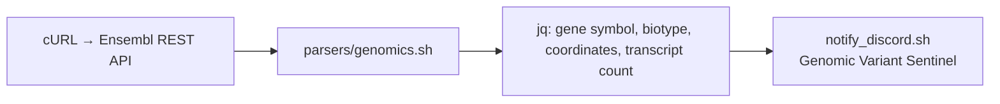
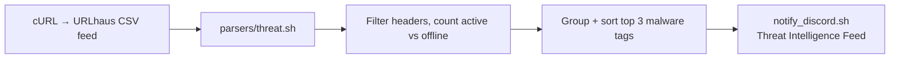

<div align="center">

# 🛡️ Log-Sentinel & Multi-Stream Intelligence Orchestrator

### A Serverless, Zero-Storage DevOps & Data Intelligence System

*Ingests. Parses. Alerts. Vanishes.*


</div>

---

## 📖 Table of Contents

- [What Is This?](#-what-is-this)
- [Architecture at a Glance](#-architecture-at-a-glance)
- [Why "Zero Storage"?](#-why-zero-storage)
- [Directory Structure](#-directory-structure)
- [The Five Pipelines](#-the-five-pipelines)
- [How Each Pipeline Works](#-how-each-pipeline-works-under-the-hood)
- [Engineering Challenges & Fixes](#-engineering-challenges--fixes)
- [Getting Started (Run It Yourself)](#-getting-started-run-it-yourself)
- [Testing Every Pipeline Yourself](#-testing-every-pipeline-yourself)
- [Sample Discord Alert](#-sample-discord-alert)
- [Tech Stack](#-tech-stack)
- [Roadmap](#-roadmap)
- [License](#-license)

---

## 🧠 What Is This?

**Log-Sentinel** is a serverless orchestration system that lives entirely inside **GitHub Actions**. It has no server, no database, and no persistent disk — every pipeline spins up on a temporary GitHub-hosted runner, does its job, fires off a rich Discord alert, and then the entire environment is **destroyed**.

It does two very different jobs with the same underlying engine:

1. **Log Sentinel Mode** — tears through multi-gigabyte historical/synthetic server access logs (up to 10M+ records) with pure `awk`/`grep`/`sort` pipelines to flag error spikes and offending IPs.
2. **Live Intelligence Mode** — polls real-time public REST APIs (crypto markets, genomic databases, cyber-threat feeds) and turns raw JSON/CSV into human-readable Discord reports.

Everything is written in **Bash/Zsh**, tested locally on **WSL**, and deployed as scheduled **GitHub Actions cron workflows**.

---

## 🏗️ Architecture at a Glance



**The core idea:** every pipeline follows the same skeleton — *fetch → parse → summarize → notify → self-destruct*. Only the fetcher and parser change per domain.

---

## 💾 Why "Zero Storage"?

GitHub-hosted runners allocate temporary disk space (`/home/runner/work/...`) that exists **only for the lifetime of the job**. Log-Sentinel is deliberately architected around this constraint instead of fighting it:

| Traditional Log Pipeline | Log-Sentinel |
|---|---|
| Needs a persistent server/VM | Runs entirely inside a GitHub Actions runner |
| Logs pile up on disk over time | Logs are downloaded, processed, and discarded in the same job |
| Requires a database for history | Stateless — each run is a clean snapshot, delivered via Discord |
| Ongoing hosting cost | **$0** — runs on GitHub's free Actions minutes |

---

## 📂 Directory Structure

```
log-sentinel/
│
├── bin/
│   ├── fetch_data.sh          # 🔽 Universal fetcher: Kaggle API or REST/cURL
│   ├── sentinel.sh            # 🔍 High-throughput log analyzer (awk/grep engine)
│   ├── notify_discord.sh      # 📣 Builds & sends Discord Rich Embed payloads
│   │
│   └── parsers/
│       ├── crypto.sh          # 💰 24h price, % change, volume, high/low
│       ├── genomics.sh        # 🧬 Gene symbol, biotype, coordinates, transcripts
│       └── threat.sh          # ☣️  Active vs total malicious URLs, top malware tags
│
└── .github/
    └── workflows/
        ├── ecommerce_pipeline.yml   # 🛒 10M+ record e-commerce log sentinel
        ├── crypto_pipeline.yml      # 📈 Synthetic 10K-record platform log sentinel
        ├── crypto.yml               # 🪙 Live Binance BTC/USDT market alert
        ├── genomics.yml             # 🧬 Live Ensembl gene monitor
        └── threat.yml                # 🛡️ Live URLhaus threat intel tracker
```

---

## ⚙️ The Five Pipelines

<table>
<tr>
<th>Pipeline</th>
<th>Type</th>
<th>Data Source</th>
<th>Scale</th>
<th>Schedule</th>
</tr>
<tr>
<td>🛒 <b>E-Commerce Sentinel</b></td>
<td>Historical Log Analysis</td>
<td>Kaggle: <code>eliasdabbas/web-server-access-logs</code></td>
<td>3.5 GB / 10.3M+ records</td>
<td>Daily @ 19:00 UTC + manual</td>
</tr>
<tr>
<td>📈 <b>Crypto Platform Sentinel</b></td>
<td>Synthetic Log Analysis</td>
<td>Kaggle: <code>adepvenugopal/webserverlogs10k</code></td>
<td>10,000 records</td>
<td>Every 6 hours + manual</td>
</tr>
<tr>
<td>🪙 <b>Crypto Market Alert</b></td>
<td>Live Market Intelligence</td>
<td>Binance <code>/api/v3/ticker/24hr</code></td>
<td>Real-time</td>
<td>On-demand / configurable cron</td>
</tr>
<tr>
<td>🧬 <b>Genomics Variant Monitor</b></td>
<td>Live Biological Data</td>
<td>Ensembl REST <code>/lookup/symbol</code></td>
<td>Real-time</td>
<td>On-demand / weekly cron</td>
</tr>
<tr>
<td>🛡️ <b>Threat Intel Tracker</b></td>
<td>Live Cybersecurity Intelligence</td>
<td>Abuse.ch URLhaus <code>csv_recent</code></td>
<td>Real-time</td>
<td>On-demand / daily cron</td>
</tr>
</table>

---

## 🔬 How Each Pipeline Works (Under the Hood)

### 🛒 E-Commerce & 📈 Crypto Platform Sentinels

Both sentinels share the exact same `sentinel.sh` engine — only the input dataset differs. This proves the parser is format-agnostic across real-world and synthetic access logs.

### 🪙 Crypto Market Alert


### 🧬 Genomics Variant Monitor


### 🛡️ Threat Intel Tracker


---

## 🛠️ Engineering Challenges & Fixes

Real problems hit while building this on WSL/Zsh and deploying to Linux-based GitHub runners — documented here so future-me (and you) don't repeat them.

<details>
<summary><b>❌ Missing directory on a clean VM</b></summary>

**Cause:** `.gitignore` excluded empty `logs/` and `reports/` directories, so fresh runners had nothing to write to.
**Fix:** Added `mkdir -p logs reports` directly into the workflow setup step, every run.
</details>

<details>
<summary><b>❌ Zsh glob panics (<code>no matches found</code>)</b></summary>

**Cause:** Zsh throws an error when a wildcard expands against an empty directory — Bash doesn't, so this only bit locally on WSL Zsh.
**Fix:** `setopt +o nomatch` in local scripts, and swapped fragile wildcard moves for `find` queries in shared code.
</details>

<details>
<summary><b>❌ Hardcoded paths broke on GitHub runners</b></summary>

**Cause:** Scripts assumed `$HOME/projects/...` locally, but Actions runners use `/home/runner/work/...`.
**Fix:** All fetchers/parsers now resolve paths relative to `$(pwd)` dynamically — no hardcoding, anywhere.
</details>

<details>
<summary><b>❌ Literal <code>\n</code> in Discord payloads / inconsistent shell logic</b></summary>

**Cause:** Raw `jq` strings leaked unescaped `\n` characters, and compound conditionals behaved differently across Zsh vs Bash runners.
**Fix:** Standardized the entire alert builder on Bash, restructured conditionals, and switched to structured Discord Embed JSON objects instead of string concatenation.
</details>

---

## 🚀 Getting Started (Run It Yourself)

### 1. Fork or clone the repo
```bash
git clone https://github.com/AbdulRaffayQureshi/log-sentinel.git
cd log-sentinel
chmod +x bin/*.sh bin/parsers/*.sh
```

### 2. Create a Discord webhook
1. In your Discord server → **Server Settings → Integrations → Webhooks → New Webhook**
2. Copy the webhook URL.

### 3. Add repository secrets
Go to **GitHub repo → Settings → Secrets and variables → Actions → New repository secret**

| Secret Name | Required For | Value |
|---|---|---|
| `DISCORD_WEBHOOK_URL` | All pipelines | Your Discord webhook URL |
| `KAGGLE_USERNAME` | E-Commerce & Crypto Platform Sentinels | Your Kaggle account username |
| `KAGGLE_KEY` | E-Commerce & Crypto Platform Sentinels | Your Kaggle API key (from `kaggle.json`) |

> 💡 Get your Kaggle key at **kaggle.com → Account → Create New API Token** — it downloads a `kaggle.json` containing both values.

### 4. Enable Actions
GitHub disables scheduled workflows on forks by default — go to the **Actions** tab of your repo and click **"I understand my workflows, go ahead and enable them."**

---

## 🧪 Testing Every Pipeline Yourself

Every workflow supports `workflow_dispatch`, so you can trigger any pipeline **on demand** without waiting for the cron schedule.

### Option A — via the GitHub UI (easiest)
```
Repo → Actions tab → select a workflow (e.g. "Crypto Market Alert")
→ "Run workflow" button → Run workflow
```
Watch the live log stream, then check your Discord channel for the embed.

### Option B — via GitHub CLI (`gh`)
```bash
# Install gh if you don't have it: https://cli.github.com

# Trigger the live crypto alert
gh workflow run crypto.yml

# Trigger the genomics monitor
gh workflow run genomics.yml

# Trigger the threat intel tracker
gh workflow run threat.yml

# Trigger the heavier log sentinels
gh workflow run ecommerce_pipeline.yml
gh workflow run crypto_pipeline.yml

# Watch the most recent run live
gh run watch
```

### Option C — run scripts locally first (WSL/Zsh recommended)
Before trusting Actions, sanity-check any parser directly on your machine:
```bash
# Example: test the live crypto parser locally
export DISCORD_WEBHOOK_URL="your_webhook_url_here"
./bin/fetch_data.sh --source binance
./bin/parsers/crypto.sh ./data/btcusdt.json
./bin/notify_discord.sh --template crypto
```
This mirrors exactly what the runner does — if it works locally on Zsh, it'll work in the pipeline (that parity was one of the core engineering goals of this project).

### Expected turnaround
| Pipeline | Typical Run Time |
|---|---|
| Crypto Market Alert | ~10–20 sec |
| Genomics Variant Monitor | ~10–20 sec |
| Threat Intel Tracker | ~15–30 sec |
| Crypto Platform Sentinel (10K records) | ~30–60 sec |
| E-Commerce Sentinel (10M+ records) | ~2–5 min |

---

## 💬 Sample Discord Alert

```
┌──────────────────────────────────────────┐
│  🛡️  Threat Intelligence Feed             │
├──────────────────────────────────────────┤
│  Active malicious URLs:      1,842        │
│  Total tracked (24h):        5,109        │
│  Top malware tags:                        │
│    1. AgentTesla   (312)                  │
│    2. RemcosRAT     (201)                 │
│    3. Formbook       (176)                │
│                                            │
│  Source: Abuse.ch URLhaus · csv_recent    │
└──────────────────────────────────────────┘
```
*(Actual alerts render as full Discord Rich Embeds with color-coded severity, not plain text.)*

---

## 🧰 Tech Stack

| Layer | Tools |
|---|---|
| **Scripting** | Bash, Zsh (developed & tested on WSL) |
| **Orchestration** | GitHub Actions (scheduled cron + manual dispatch) |
| **Text/Log Processing** | `awk`, `grep`, `sort`, `uniq`, `wc`, `find` (GNU Coreutils) |
| **JSON Processing** | `jq` |
| **Data Sources** | Kaggle API CLI, Binance REST API, Ensembl REST API, Abuse.ch URLhaus |
| **Alerting** | Discord Webhooks (Rich Embed JSON payloads) |
| **Compute Model** | Ephemeral GitHub-hosted runners — zero persistent storage |

---

## 🗺️ Roadmap

- [ ] Add Slack alert target alongside Discord
- [ ] Add historical trend comparison (previous run vs current, delta %)
- [ ] Parameterize genomics monitor for multiple genes in one run
- [ ] Add a lightweight test harness for local parser validation

---

## 📜 License

MIT — free to fork, break, and rebuild.

---

<div align="center">

Built on **WSL + Zsh**, deployed on **GitHub Actions**, alerted through **Discord**.

*No servers. No databases. No leftovers.*

</div>
